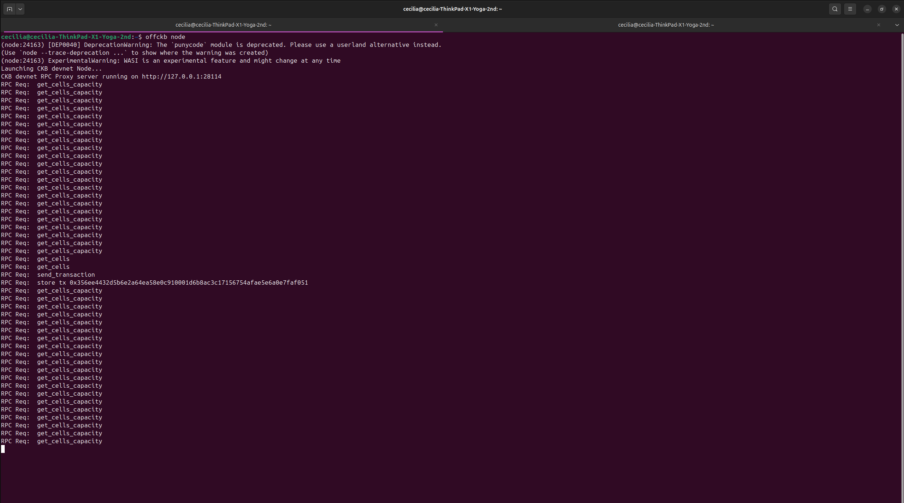
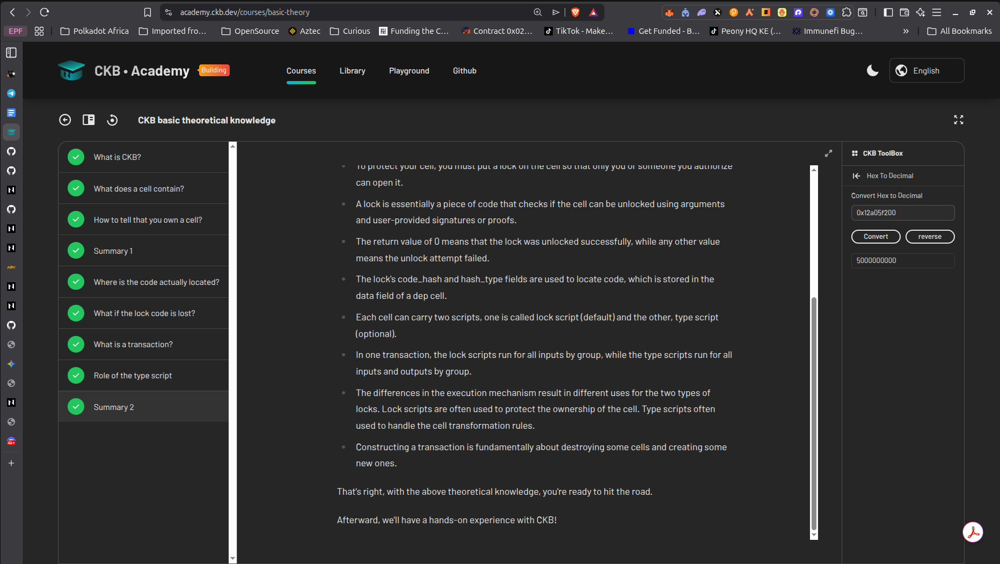
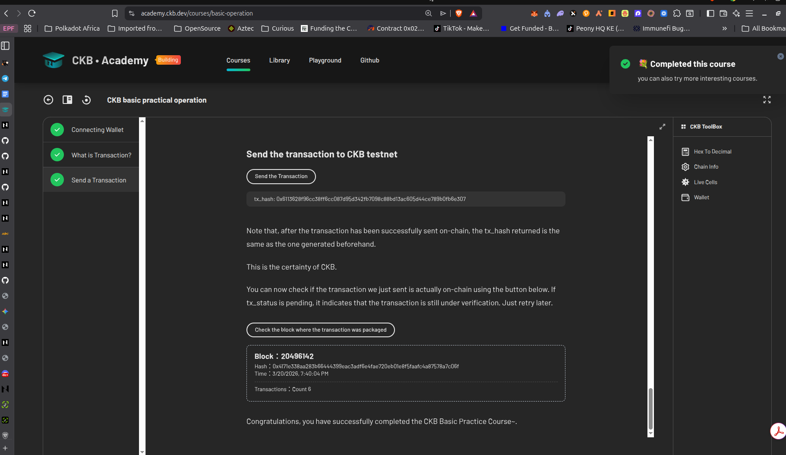
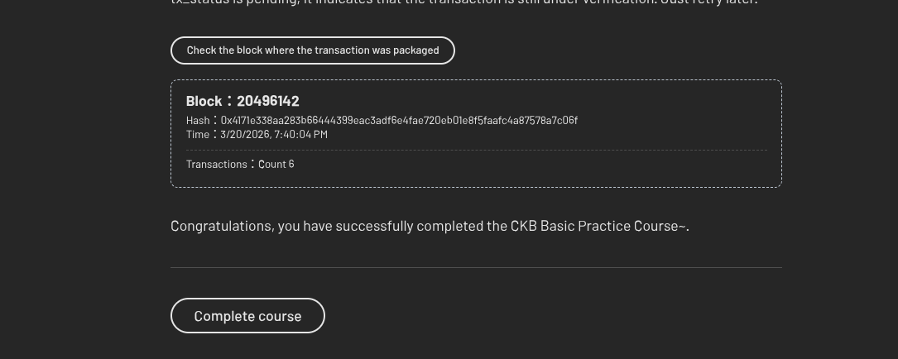

# CKB Builder Track — Week 1

**Week Ending:** 2026-03-20

---

## Courses & Reading Completed

- **Introduction to Nervos CKB**: core technical concepts and terminology
- **Getting Started on CKB**: set up local dev environment using OffCKB
  

- **CKB Academy — Lessons 1 & 2:**

  - CKB Theoretical Knowledge:
    - Structure of a cell
    - Structure of a transaction
  - Proof of completion
    - Lesson 1
      
    - Lesson 2
      
      Transaction on block explorer:
      [tx](https://testnet.explorer.nervos.org/transaction/0x6113628f96cc38ff6cc087d95d342fb7098c88bd13ac605d44ce789b0fb6e307)
      

- **Introduction to Script** — overview of smart contracts on CKB
- **[RFC 0025 — Simple UDT](https://github.com/nervosnetwork/rfcs/blob/master/rfcs/0025-simple-udt/0025-simple-udt.md)** — standard for fungible tokens on CKB

---

## Practical Exercises

| Exercise           | Status | Link                                        |
| ------------------ | ------ | ------------------------------------------- |
| Transfer CKB       | Done   | [simple-transfer](./simple-transfer/)       |
| Store Data on Cell | Done   | [store-data-on-cell](./store-data-on-cell/) |

---

### Simple Transfer: [simple-transfer/](./simple-transfer/)

A minimal dApp that connects a CKB wallet, displays the balance, and sends a CKB transfer on-chain.

**What I learned:**

- How the CKB cell model works in practice
- Using CCC (Common Chain Connector) to interact with wallets and broadcast transactions
- The difference between lock scripts and type scripts at a basic level

**Proof of completion:** [View transaction on explorer](https://testnet.explorer.nervos.org/transaction/0xc3a71dd081c3b73df34d667bd05f402e28dde81a4333e64ed91a78909d8d9afc)

**Reference:** [Official tutorial](https://docs.nervos.org/docs/dapp/transfer-ckb)

---

### Store Data on Cell: [store-data-on-cell/](./store-data-on-cell/)

A dApp that writes and reads arbitrary data to/from a cell on the CKB blockchain.

**What I learned:**

- How to store data in the `data` field of a CKB cell
- Reading cell data back from the chain
- The lifecycle of a cell: creation, update, and consumption

**Proof of completion:** [View transaction on explorer](https://testnet.explorer.nervos.org/transaction/0xacf26367645f894d04a32a8dcda26caacff9a6b2bd4c54ed475dd92e23e2680a)

**Reference:** [Official tutorial](https://docs.nervos.org/docs/dapp/store-data-on-cell)

---

## Key Learnings

- Understood the **CKB cell model**: cells carry `capacity`, `data`, `lock`, and optionally `type`
- **Capacity** locks up CKB proportional to the cell's byte size:unlike Ethereum gas fees, it's not spent; you get it back when the cell is consumed
- **Lock scripts** control ownership via `code_hash`, `hash_type`, and `args` (typically a hash of the user's public key)
- **Type scripts** are optional and enforce custom validation logic (e.g. token rules)
- Script code is not stored in every cell — `code_hash` points to a system cell holding the bytecode, keeping the chain efficient
- A **transaction** consumes existing cells as inputs and creates new ones as outputs; cells cannot be edited in place
- Cells are identified by **outpoints** (`txHash` + `index`), which is how inputs reference the cells they consume
- A **live cell** is one that has been created but not yet consumed; reading a cell requires its outpoint and checking it is still live
- Cell `data` is a single raw byte sequence;multiple values can be encoded into it but the protocol sees one blob
