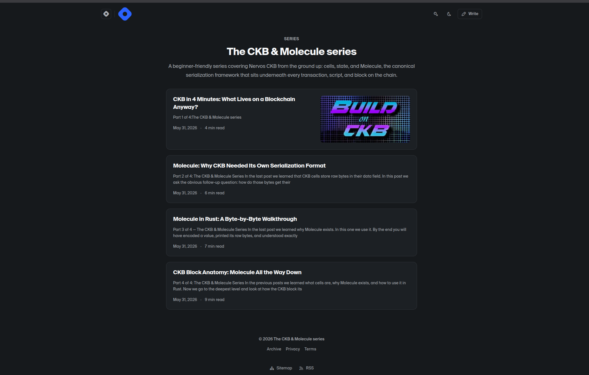

# CKB Builder Track - Week 11

**Week Ending:** 2026-05-29

---

## Focus This Week

Stepped back from `groth16-ckb` for a week and reflected on one of the outstanding topics in CKB I keep using but had never written up properly: Molecule. Published a short series of blogs and tutorials on Hashnode.

**Series:** [CKB Molecule Series](https://mulandi.hashnode.dev/series/ckb-molecule-series)

---

## Why this week

Molecule has shown up in almost everything I've built so far. The `AgentRecord` in Spectre, the `Groth16VerifyingKey` / `Groth16Witness` in the verifier, the integration-test fixtures. I had a working understanding but I noticed I was making layout decisions by pattern-matching against examples rather than from first principles. A week of writing it up seemed like the right way to fix that, and the result is reusable for anyone else picking it up.
